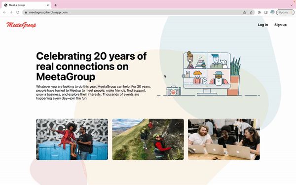
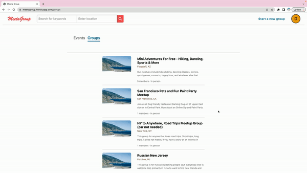
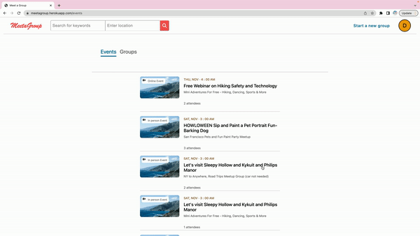

README

Link to live site [MeetaGroup](https://meetagroup.herokuapp.com/)

## Introduction of MeetaGroup

MeetaGroup is a clone of [Meetup](https://www.meetup.com/), it has most of Meetup's functionality. For example, it allows users to create their own groups,
update their groups, as well as deleting the groups. All of the users can explore and search different groups and events. After logging in or signing up,
they can request to join any group they are interested in. After joining the group, they can request to attend or change their RSVP for a specific event
that is related to the group they joined.

## Usage descriptions of features

### Homepage

### Login modal

### All groups and group details

### All events and event details

### Searching page

## Tech Stack

Frameworks, Platforms, and Libraries:

